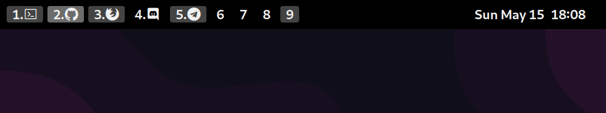

# Cantarell + Nerd Fonts



GNOME extension: https://extensions.gnome.org/extension/3851/workspaces-bar/

## Quick install

1) Download [the latest release](https://github.com/s373r/cantarell-nerd-fonts-complete/releases/latest)
2) Install fonts

## How to patch Cantarell font (or any)

1) Clone Nerd Fonts repo
```shell
git clone https://github.com/ryanoasis/nerd-fonts --depth 1 && cd nerd-fonts
```

2) Download `FontForge*.AppImage` (or use [the latest stable release](https://github.com/ryanoasis/nerd-fonts/releases))
```shell
curl -O https://github.com/fontforge/fontforge/releases/download/20220308/FontForge-2022-03-08-582bd41-x86_64.AppImage
chmod +x ./FontForge-*.AppImage
```

3) Patch each font
```shell
fonts=(
    "/usr/share/fonts/abattis-cantarell-fonts/Cantarell-Bold.otf"
    "/usr/share/fonts/abattis-cantarell-fonts/Cantarell-ExtraBold.otf"
    "/usr/share/fonts/abattis-cantarell-fonts/Cantarell-Light.otf"
    "/usr/share/fonts/abattis-cantarell-fonts/Cantarell-Regular.otf"
    "/usr/share/fonts/abattis-cantarell-fonts/Cantarell-Thin.otf"
)
out_dir="${PWD}/cantarell-nerd-fonts-complite"

for font in "${fonts[@]}"; do
    echo "Patch ${font}..."
    ./FontForge*.AppImage -script ${PWD}/font-patcher -c "${font}" -out "${out_dir}" --careful
done
```

4) Move generated fonts
```shell
font_dir="~/.local/share/fonts"

mkdir -p "${font_dir}"
cp "${out_dir}" "${font_dir}"
```

5) Regenerate font cache
```shell
fc-cache -rf
```

## Thanks to

- https://gitlab.gnome.org/GNOME/cantarell-fonts
- https://github.com/ryanoasis/nerd-fonts
- https://github.com/fontforge/fontforge
